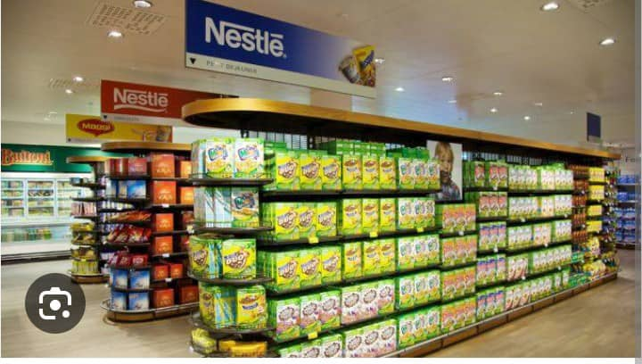
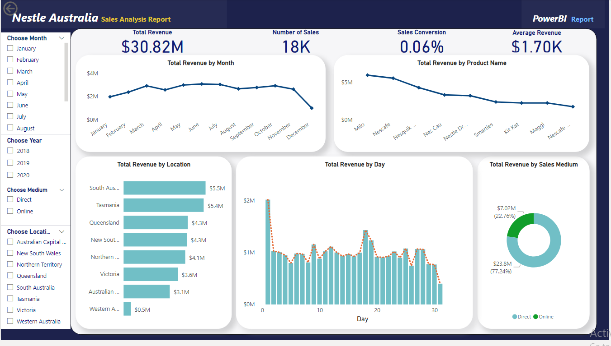

# Sales Analysis Using PowerBI

---

## Introduction
This is a sales analytic on raw data from Nestle, Australia. Power BI was used to develop a report to help the company take decision on its expansion plans. The company needed actionable insights to expand its business by adding new product lines and also needed to check how the product were performing across locations and especially what sales medium was preferred by customers across board.

## Problem Statement
1.	What is the total revenue for each year and the month with the highest revenue?
2.	What is the product with the highest and lowest revenue?
3.	What location had the highest and lowest sales?
4.	What location has the most sales and the medium used more in each location
5.	What is the month with the highest revenue in each year?
6.	What is the trend of sales per month?
7.	What is the trend of total sales per product in the last 3 years?
8.	Which sales medium generated the most revenue?
   
## Skills/Concept Demonstrated
The following features in Power BI was incorporated:
- Extract, Transform, Load
- Power Query
- DAX
  
## Data Modelling 
No modelling was required as the dataset contained only one table.

## Data Transformation
I downloaded the dataset as a csv file from its source and imported it into Power Query. The dataset was quite clean but I did a little transformation by splitting the sales date column into year and month column then assigned appropriate datatypes to each columns in the dataset before loading it into Power BI. I also calculated the KPIs by creating measures in Power BI which helps in the result of our analysis. Several charts and slicers were then used to design a dynamic and interactive dashboard which helped me to generate insight into the operation of the company.

## Visualization

## Insights
The following insights was drawn from the analysis:
- The total revenue generated in 2018 was $8.71M with 6147 sales. July was the month with the highest revenue in 2018 with a total of $953,529 in revenue and 650 sales. The sales medium that generated the highest was the direct sales with 76.54% while the online medium generated 23.46%.
- In 2019, the total revenue generated was $12.62M with 6055 sales. September being the highest month with 625 sales and a revenue $1,293,290. The online medium accounted for 29.5% of the revenue generated while direct sales had 70.5%.
- The total revenue for the year 2020 is $9.49M with 5,913 sales. The month of May accounted for the highest revenue generated in that year, $1078,755 with 496 sales. The online medium of sales accounted for 24.27% of the total revenue while the direct medium accounted for 75.73%
- The total revenue for the three years under review 2018, 2019 and 2020 is $30.82M with 18K sales. The sales medium preferred by customers is the direct sales accounting for a 77.24% of the total revenue. 
- The company generated the most revenue in the year 2019, a percentage total of 40.95% of the total revenue, followed by the year 2020 with 30.78%. The year 2018 generated only 28.27% of the total revenue which accounted for the least revenue generated by year.
- The location with the highest revenue is South Australia with a total revenue of $5.5M and 3143 sales out of the total sales of 18K. 1965 of the sales was conducted directly while 1178 purchases used the online sales medium. This was followed closely by Tasmania with a total revenue of $5.4M and a total sale of 3187. Western Australia had the least revenue, generating only $0.5M and a total sale of 271 only. 162 of the sales was conducted through the direct medium while 109 purchases were made online.
- By product, the product with the highest demand is Nescafe in 2018 and 2019 and became the second highest in 2020 with a total revenue of $5.54M with 6368 sales. Milo generated the most revenue of $5.95M with only 1619 sales. Maggi and Nescafe Gold brought in the least revenue for the company.
  
## Recommendation
With the world being a global village, it is expected that online sales should be one of the highest performing medium through which customer purchase products. It is expected to bridge the gap between location and customers but based on the analysis, it can be concluded that the online medium has performed below its potential. It is therefore recommended that special attention be given to the online platform to see what could lead to its low performance. Factors such as a difficult user interface i.e. the website for online purchase not being user friendly, late delivery of goods purchased by customers through the online medium and a general lack of trust in product quality found online as compared to seeing it for themselves in stores might be factors contributing to the low usage of the online medium.

